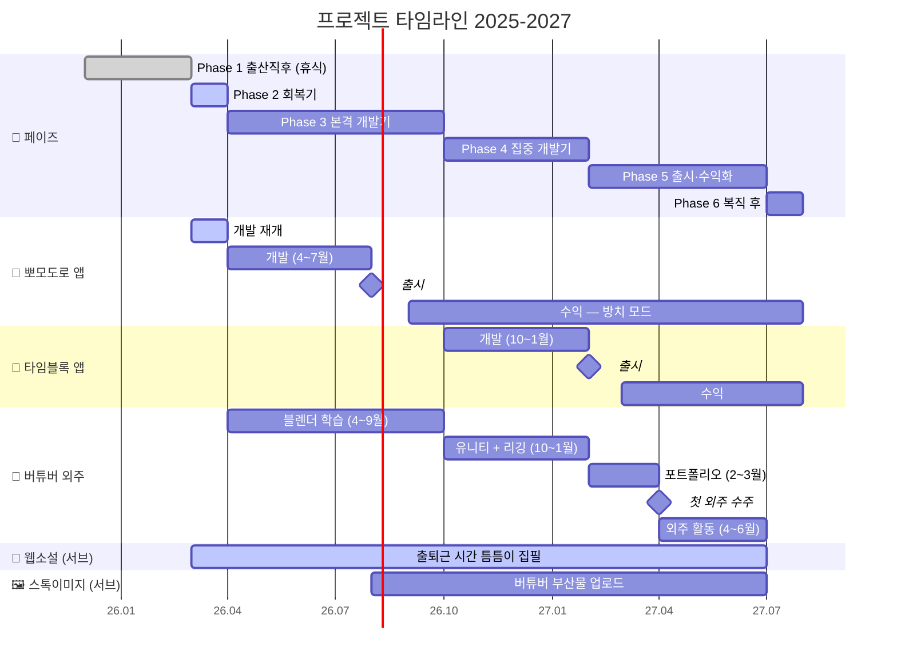

# 프로젝트 타임라인 (2025-2027)

> 원본 HTML 파일: [[2026_ProjectTimeline]] (시각적 Gantt 뷰)
> 현재 페이즈: **Phase 2 — 🌱 회복기** (2026.03)

## 간트 차트

## 페이즈별 요약

| 페이즈 | 기간 | 테마 | 주요 목표 |
|--------|------|------|-----------|
| Phase 1 | 2025.12 ~ 2026.02 | 😴 출산직후 (휴식) | 아무것도 안 함. 죄책감 금지. |
| **Phase 2** | **2026.03** | **🌱 회복기** | **뽀모도로 재개, 웹소설 시작** |
| Phase 3 | 2026.04 ~ 2026.09 | 🔨 본격 개발기 | 뽀모도로 완성 + 블렌더 학습 |
| Phase 4 | 2026.10 ~ 2027.01 | 🎯 집중 개발기 | 타임블록 개발 + 유니티 리깅 |
| Phase 5 | 2027.02 ~ 2027.06 | 🚀 출시·수익화 | 타임블록 출시 + 버튜버 첫 외주 |
| Phase 6 | 2027.07~ | 💼 복직 후 | 방치 수동소득 유지 |

## 월별 예상 수익 (만원)

| 항목 | 3월 | 4월 | 5월 | 6월 | 7월 | 8월 | 9월 | 10월 | 11월 | 12월 | 1월 | 2월 | 3월 | 4~6월 | 복직후 |
|------|-----|-----|-----|-----|-----|-----|-----|------|------|------|-----|-----|-----|-------|--------|
| 📱 앱 | ~10 | ~10 | ~10 | ~10 | ~10 | 30 | 40 | 45 | 50 | 50 | 50 | 50 | 55 | 55 | 60 |
| 🎨 버튜버 | - | - | - | - | - | - | - | - | - | - | - | 50 | 80 | 80 | 120 |
| 🖼️ 기타 | - | - | - | - | - | ~1 | 3 | 3 | 4 | 5 | 5 | 5 | 5 | 5 | 5 |
| **💰 합계** | **~10** | **~10** | **~10** | **~10** | **~10** | **~31** | **43** | **48** | **54** | **55** | **55** | **105** | **140** | **140** | **185** |

> 목표: 복직 후 월 **185만원** 수동소득 달성

## 프로젝트별 현황

### 📱 뽀모도로 앱 (Pomory)
- **레포**: [Pomory](https://github.com/kkanbi/Pomory)
- **현재**: Phase 2 개발 재개
- **출시 목표**: 2026년 8월
- **수익 모델**: 앱스토어 유료 앱 / 인앱결제

### 📱 타임블록 앱
- **현재**: 대기 (Phase 4부터 시작)
- **출시 목표**: 2027년 2월

### 🎨 버튜버 외주
- **현재**: 학습 준비 (Phase 3부터 블렌더 시작)
- **첫 수주 목표**: 2027년 4월

### 📝 웹소설
- **레포**: [Novel_Assistant](https://github.com/kkanbi/Novel_Assistant)
- **현재**: 진행 중 (틈틈이 집필)

### 🖼️ 스톡이미지
- **현재**: 대기 (뽀모도로 앱 출시 후 버튜버 부산물 활용)
- **목표**: 600장 업로드
