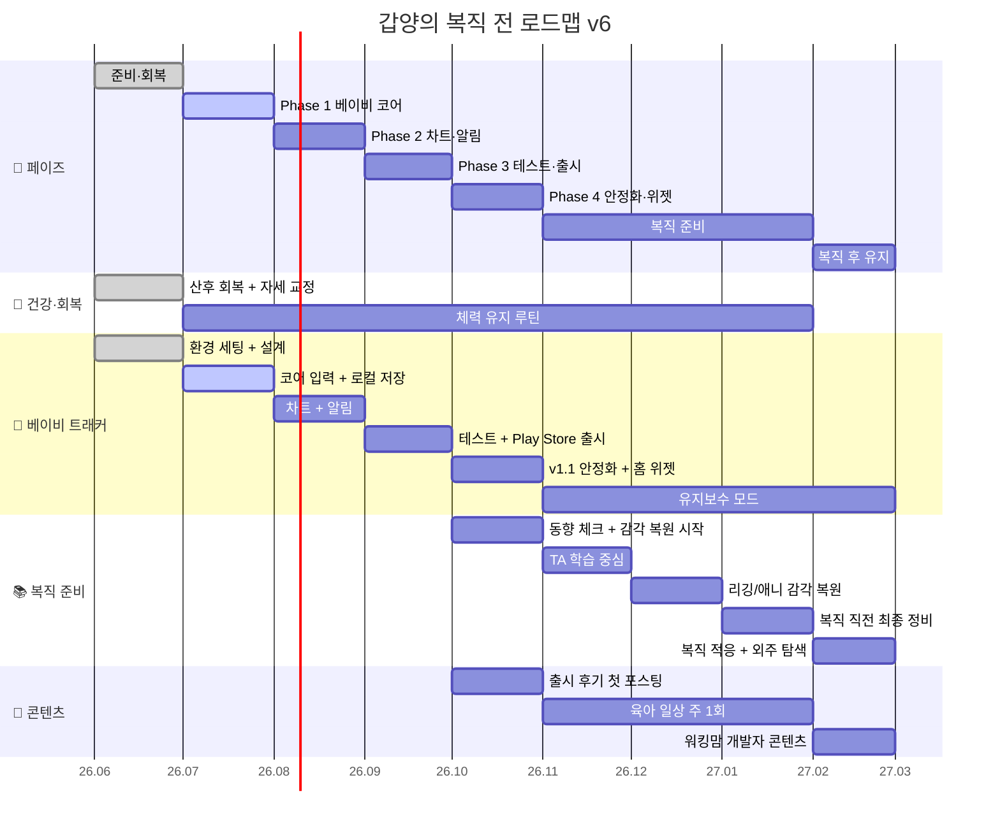

# 갑양의 복직 전 로드맵 v6

> **원본 파일(Single Source of Truth)**: 프로젝트를 추가하거나 일정을 바꿀 때는 이 파일만 수정하면 됩니다.
> **시각화 파일**: `2026_ProjectTimeline.html`은 보기용이라 자동화 기준이 아닙니다.

> 기준 파일: `timeline_v6.jsx`
> 기준 시점: 2026년 7월 1일
> 전략: **베이비 트래커 1개 집중 출시 → 2026년 11월부터 3개월간 복직 준비**

## 한 줄 전략

- 뽀모도로 RPG는 복직 후 검토
- 2026년 하반기는 **베이비 트래커 1개**에만 집중
- 2026년 11월부터는 앱을 유지보수 모드로 낮추고 **TA 실무 감각 회복**에 집중
- 체력 회복과 육아 리듬을 우선순위에서 내리지 않음

## 간트 차트

## 월별 로드맵

| 기간 | 테마 | 핵심 목표 |
|------|------|-----------|
| 2026.06 | 체력 회복 + 준비 | Flutter 환경 세팅, HTML 프로토를 Flutter 설계로 전환 |
| 2026.07 | 베이비 트래커 코어 | 입력 버튼, Hive 저장, Riverpod 상태관리, 헬멧 24h 로직 |
| 2026.08 | 차트 + 알림 | 미니차트, 일간 상세, 통계 모달, 로컬 알림 |
| 2026.09 | 테스트 + 출시 | 실사용 테스트, 버그 수정, 개인정보 처리방침, Play Store 제출 |
| 2026.10 | 안정화 + 위젯 | 홈 위젯, 실사용 피드백 반영, 출시 후기 포스팅 |
| 2026.11 | 복직 준비 시작 | 3ds Max/Maya, MaxScript/Python, Unreal 최신 흐름 복습 |
| 2026.12 | TA 실무 + 포폴 정리 | Blender 리깅 복습, 샘플 1개 완성, 포트폴리오 업데이트 |
| 2027.01 | 복직 직전 최종 정비 | 회사 동향 파악, 수면 패턴 조정, 앱 1.2 마이너 업데이트 |
| 2027.02~ | 복직 후 유지 | 앱 분기별 업데이트, 워킹맘 개발자 콘텐츠, 외주 시장 탐색 |

## 페이즈별 상세

### 2026년 6월 — 체력 회복 + 준비
- 목표: 산후 회복 + Flutter 환경 세팅
- 건강: 존2 걷기, 산후 코어, 자세 교정
- 개발: Flutter 개발 환경 세팅, Claude Code 셋업, HTML 프로토를 Flutter 설계로 전환
- 학습: Hive, Riverpod 기초 학습

### 2026년 7월 — 베이비 트래커 코어
- 목표: 기본 입력 + 로컬 저장
- 개발:
  - 수유, 기저귀, 수면, 헬멧 버튼 입력
  - Hive 저장
  - Riverpod 상태관리
  - 분유 버튼 길게 누르기
  - 헬멧 24시간 슬라이딩 로직
- 원칙: UI는 HTML 프로토를 그대로 사용, 디자인 재작업 금지

### 2026년 8월 — 차트 + 알림
- 목표: 시각화 + 푸시 알림
- 개발:
  - 24시간 가로 스크롤 미니차트
  - 일간 상세 모달
  - 주간/월간 통계 모달
  - `flutter_local_notifications`
  - 카테고리 필터 + 메모 입력

### 2026년 9월 — 테스트 + Play Store 출시
- 목표: MVP 출시
- 개발:
  - 1주일 실사용 테스트
  - 버그 수정, 엣지 케이스 처리
  - 개인정보 처리방침 작성
  - Google Play Console 등록
  - 스토어 스크린샷, 설명 작성, 제출

### 2026년 10월 — v1.1 안정화 + 위젯
- 목표: 사용자 피드백 반영 + Android 홈 위젯
- 개발: 버그 수정, UX 개선, `home_widget`
- 운영: `kkanddabia` 첫 포스팅, 복직 준비 사전 탐색 시작

### 2026년 11월 ~ 2027년 1월 — 복직 준비
- 11월: 3ds Max/Maya, MaxScript/Python, Unreal 5 감각 복원
- 12월: Blender 리깅 워크플로우 복습, 캐릭터 리깅 샘플 1개
- 1월: 회사 동향 파악, TA 워크플로우 정리, 수면 패턴 조정, 앱 1.2 마이너 업데이트

### 2027년 2월 이후 — 복직 후 유지
- 베이비 트래커: 분기별 업데이트
- 뽀모도로 RPG: 여력 있을 때 재검토
- 외주: 버튜버 외주 시장 탐색
- 콘텐츠: 워킹맘 개발자 관점으로 운영

## 수익 추이

| 시점 | 예상 앱 수익 |
|------|-------------|
| 2026.09 | 0~5만원 |
| 2026.10 | 5~10만원 |
| 2026.11 | 10~15만원 |
| 2026.12 | 15~20만원 |
| 2027.01 | 20만원 |
| 2027.02~ | 20~30만원 |

> 1차 목표: **복직 후에도 베이비 트래커로 월 20~30만원 유지**

## 지금 기준 우선순위

1. 베이비 트래커 9월 출시
2. 11월부터 복직 준비 전환
3. 체력 회복 루틴 유지
4. 뽀모도로 RPG와 버튜버 외주는 복직 후 재검토

## 수정 규칙

- 프로젝트 추가: 이 파일의 `projects:`와 아래 mermaid gantt만 수정
- 자동 일지 기준: 이 파일을 읽음
- HTML 파일: 시각화 전용, 필요할 때만 같이 수정
- 요약 파일: `Memory.md`, `Master_Reference.md`는 참고용 요약
